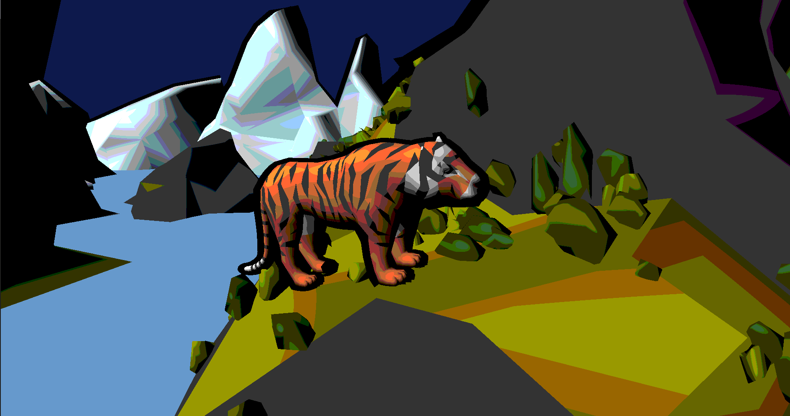
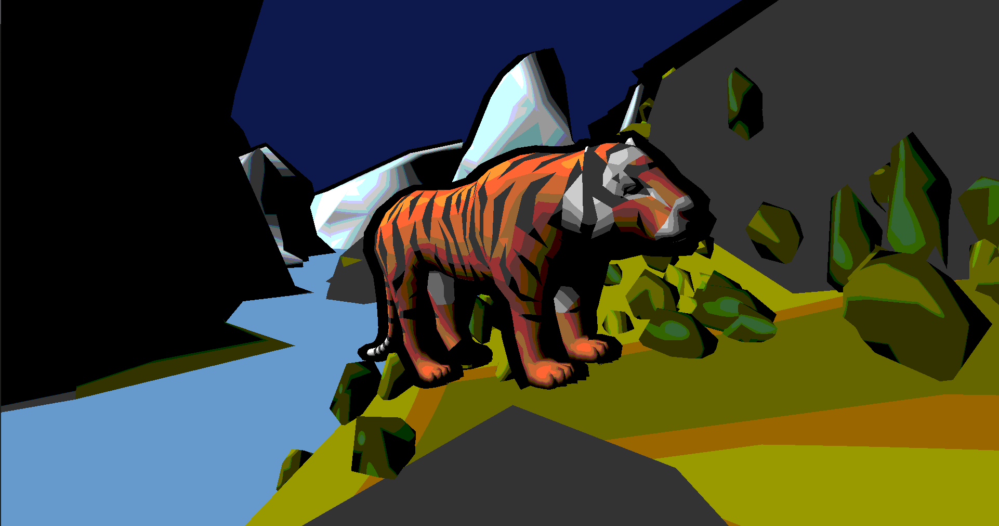

# ToonShader
This is a c++ program to experiment with toon shaders in my home made engine: SpeltEngine.
The aim for this project was to emulate a drawn look and feel, created from a 3d scene.

## First look
The following images were taken while rendering with different parameters.






## Features

This section provides an overview of all features of this specific program.

### Cel shading
The program uses cel shading to achieve a cartoon look. The steps of the cell shading can be changed via `uSteps` in the ToonShader fragment shader. This is the change you see between picture 1 and 2 in [First look](<README#First look>).

### Outlineing
To elevate the cel shader we use create a black outline around each seperate object. These outlines are rendered via the inverted hull method.


## Building and Running
This project uses cmake to build. The project was only tested on Linux. No other operating systems are gauranteed to work but may function just fine.

**Build**
```bash
mkdir build
cd build

cmake ..

cmake --build . --config Release
```

**Run**
In this version of Spelt does not yet have a way to handle resources. You need to run the compiled binary with the root of the project as the working directory.

from the root of the project run:
```bash
./build/ToonShader
```
